# Сети в Linux
Настройка сетей в Linux на виртуальных машинах.

## Содержание
1. [Part 1. Инструмент ipcalc](#title1)
2. [Part 2. Статическая маршрутизация между двумя машинами](#title2)
3. [Part 3. Утилита iperf3](#title3)
4. [Part 4. Сетевой экран](#title4)
5. [Part 5. Статическая маршрутизация сети](#title5)
6. [Part 6. Динамическая настройка IP с помощью DHCP](#title6)
7. [Part 7. NAT](#title7)
8. [Part 8. Дополнительно. Знакомство с SSH Tunnels](#title8)

## <a id="title1" style="color: white;">Part 1. Инструмент ipcalc</a>

### 1.1. Сети и маски
- Устанавливаем ipcalc командой `sudo apt install ipcalc`
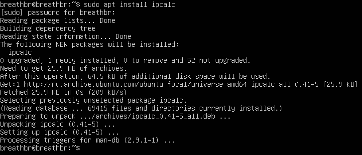
      
**1. Указываем сетевую маску в качестве входных данных хоста**

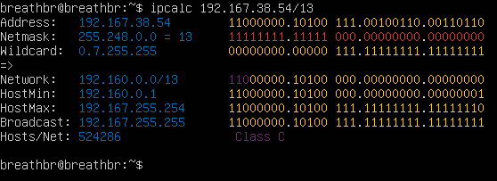
- Получаем адрес сети 192.167.38.54/13 - 192.160.0.0
  
      
**2. Перевод маски 255.255.255.0 в префиксную и двоичную запись, /15 в обычную и двоичную, 11111111.11111111.11111111.11110000 в обычную и префиксную**

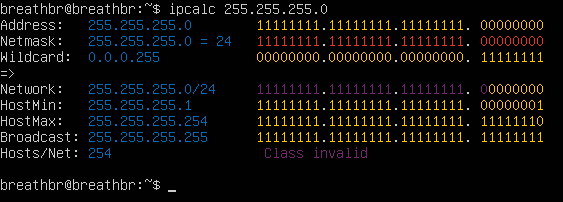

- Получаем перевод маски 255.255.255.0 в префиксную запись - /24

-  Перевод маски 255.255.255.0 в бинарную запись - 11111111.11111111.11111111. 000000000

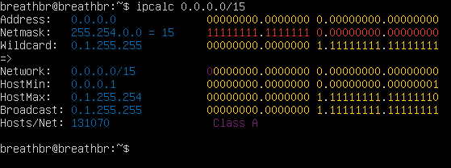

- Получаем перевод маски /15 в обычную запись - 255.254.0.0
- Перевод маски /15 в бинарную запись - 11111111.11111110.00000000. 000000000

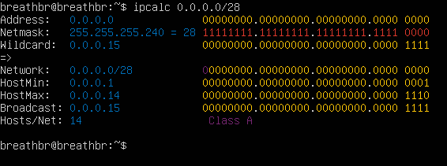
- Перевод маски 11111111.11111111.11111111.11110000 в префиксную запись - /28
- 11111111.11111111.11111111.11110000 в обычной: 255.255.255.240

**3. Минимальный и максимальный хост в сети 12.167.38.4 при масках: /8, 11111111.11111111.00000000.00000000, 255.255.254.0 и /4**

1. Указываем сеть 12.167.38.4 и маску: /8 в качестве входных данных

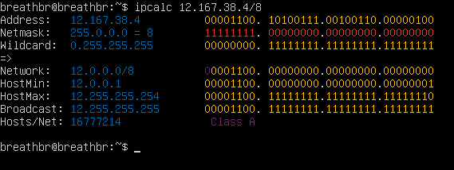 

- Минимальный хост - 12.0.0.1
- Максимальный хост - 12.255.255.254

  
2. Указываем сеть 12.167.38.4 и маску: 11111111.11111111.00000000.00000000 в качестве входных данных (мы не можем указать двоичную форму адреса в качестве ввода ipcalc, поэтому используем маску /16)

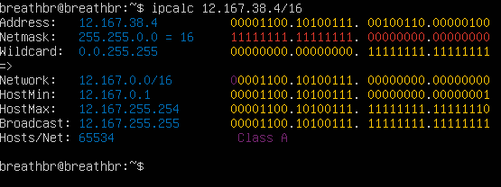
- Минимальный хост - 12.167.0.1
- Максимальный хост - 12.167.255.254

3. Указываем сеть 12.167.38.4 и маску: 255.255.254.0 в качестве входных данных

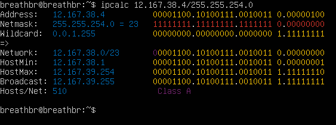
- Минимальный хост - 12.167.38.1
- Максимальный хост - 12.167.39.254

4. Указываем сеть 12.167.38.4 и маску: /4 в качестве входных данных

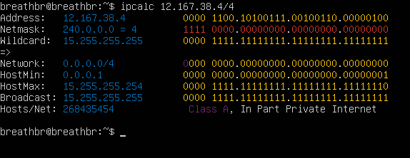
- Минимальный хост - 0.0.0.1
- Максимальный хост - 15.255.255.254

### 1.2 localhost

- 127.0.0.1 — это адрес петлевого интернет-протокола (IP), также называемый [localhost]. Адрес используется для установления IP-соединения с тем же компьютером или компьютером, который используется конечным пользователем. Установление соединения с использованием адреса 127.0.0.1 является наиболее распространенной практикой, при этом использование любого IP-адреса в диапазоне 127. *. *. * будет работать аналогично.
- Следовательно, можно обратиться к приложению, работающему на localhost, с IP: 127.0.0.2, 127.1.0, а на 194.34.23.100 и 128.0.0.1 - нет

### 1.3 Диапазоны и сегменты сетей
- Публичные: 134.43.0.2, 172.0.2.1, 192.172.0.1, 192.169.168.1, 172.68.0.2

- Частные: 10.0.0.45, 10.10.10.10, 192.168.4.2, 172.20.250.4, 172.16.255.255

- Из перечисленных IP адресов шлюза возможны у сети 10.10.0.0/18: 10.10.0.2, 10.10.10.10, 10.0.0.1

## <a id="title2" style="color: white;">Part 2. Статическая маршрутизация между двумя машинами</a>

- С помощью команды `ip a` смотрим существующие сетевые интерфейсы

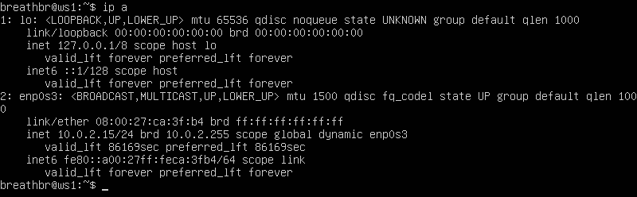
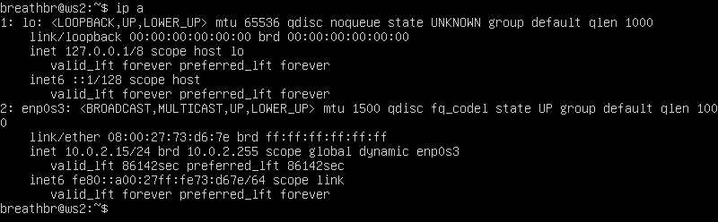

- Описан сетевой интерфейс, соответствующий внутренней сети, на обеих машинах и заданы следующие адреса и маски: ws1 - 192.168.100.10, маска /16, ws2 - 172.24.116.8, маска /12
  
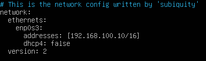
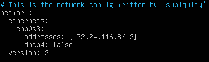

- Выполним команду `sudo netplan apply` для перезапуска сервиса сети ws1 и ws2.

### 2.1. Добавление статического маршрута вручную

- Добавим статический маршрут от ws1 до ws2 и обратно с помощью 
ip route add
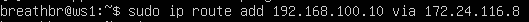
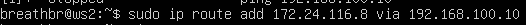

- Пропингуем на обеих машинах с помощью ping
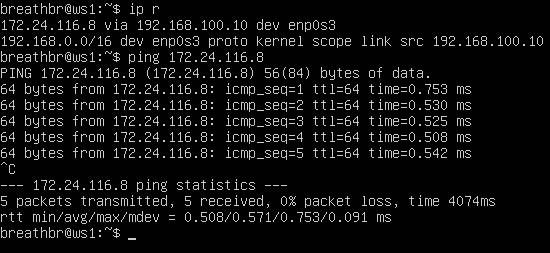
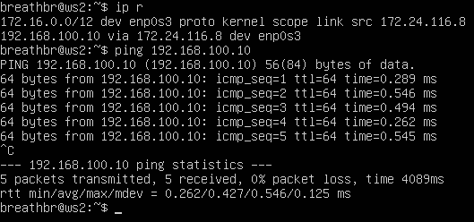

### 2.2. Добавление статического маршрута с сохранением

- Перезапускаем машины командой `reboot`
- Добавляем статический маршрут от одной машины до другой с помощью файла /etc/netplan/00-installer-config.yaml (`sudo nano /etc/netplan/00-installer-config.yaml`)

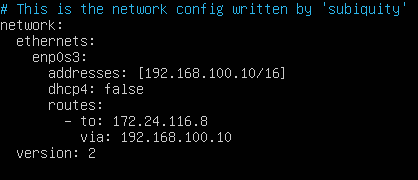
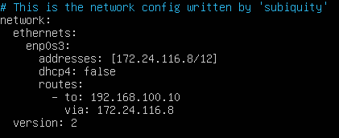

- Выполняем команду `sudo netplan apply` для перезапуска сервиса сети и пингуем машины ws1 и ws2 между собой

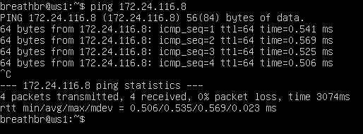
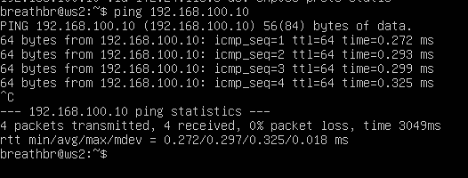

## <a id="title3" style="color: white;">Part 3. Утилита iperf3</a>

### 3.1. Скорость соединения
- 8 Mbps = 1 MB/s
- 100 MB/s = 819200 Kbps
- 1 Gbps = 1024 Mbps

### 3.2. Утилита iperf3
- Устанавливаем утилиту iperf3 командой `sudo apt install iperf3` на обе машины.
- На ws1 запускаем iperf3 в режиме сервера: `iperf3 -s`. Теперь к ws1 можно подключаться по порту 5201 клиентам iperf3:
  
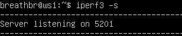

- На клиенте (ws2) запускаем iperf3 с указанием IP сервера к которому подключаемся `iperf3 -c 192.168.120.100 -R`, где
(-с — адрес сервера с запущенным iperf3 на 5201 порту; -R — режим Reverse Mode для тестирования входящей скорости)

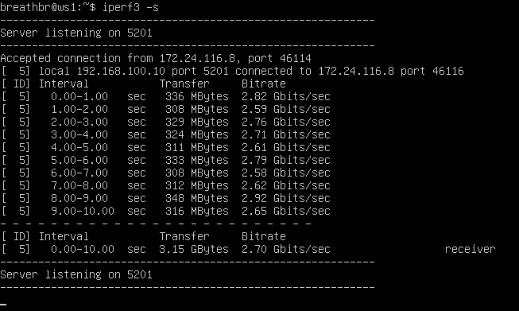

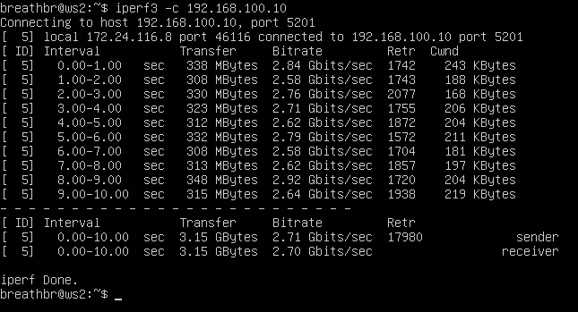

- Получаем скорость около 2.70 Gbits/sec

## <a id="title4" style="color: white;">Part 4. Сетевой экран</a>

### 4.1. Утилита iptables

- Межсетевой экран, сетевой экран(Брандмауэр, Firewall)— программный или программно-аппаратный элемент компьютерной сети, осуществляющий контроль и фильтрацию проходящего через него сетевого трафика в соответствии с заданными правилами. В GNU/Linux существует утилита *iptables* для управления и настройки межсетевого экрана. Ей мы и будем пользоваться. Создадим собственный firewall (`/etc/firewall.sh`) для ws1 и ws2.

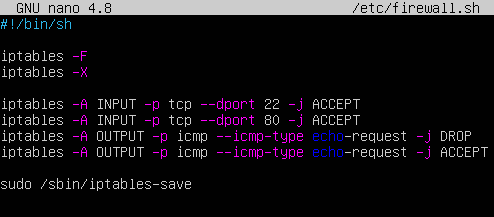
  
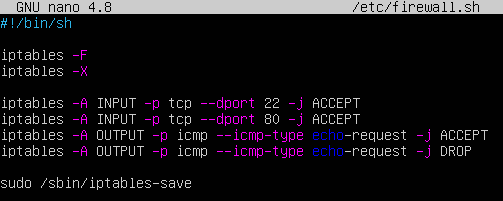

- Запустим файл командами `sudo chmod +x /etc/firewall.sh` и `sudo bash /etc/firewall.sh` и пингуем машины

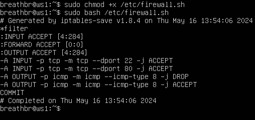

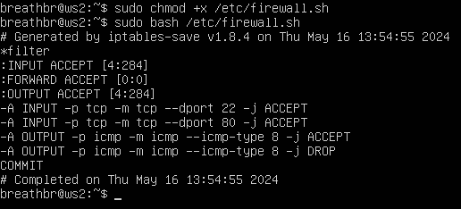

- Отличие между двумя скриптами заключается в порядке добавления правил iptables. В первом случае мы разместили запрещающее правило сначала, а во втором сначала разрешающее. Поэтому при попытке пропинговать другую машину произойдет следующее:

[ping1 firewall](images/4_5.png)

[ping2 firewall](images/4_6.png)

### 4.2. Утилита nmap

- Название Nmap это сокращение от “network mapper”, сам nmap это набор инструментов для сканирования сети. Он может быть использован для проверки безопасности, просто для определения сервисов запущенных на узле, для идентификации ОС и приложений, определения типа фаерволла используемого на сканируемом узле.

## <a id="title5" style="color: white;">Part 5. Статическая маршрутизация сети</a>

- Поднимим пять виртуальных машин (3 рабочие станции (ws11, ws21, ws22) и 2 роутера (r1, r2))

### 5.1. Настройка адресов машин

- Cодержание файла etc/netplan/00-installer-config.yaml для каждой машины:

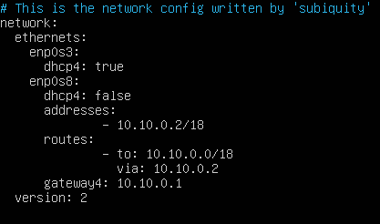

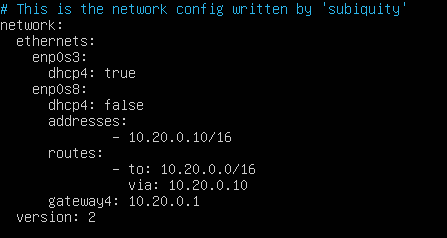

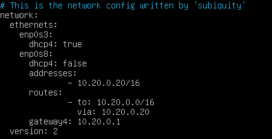

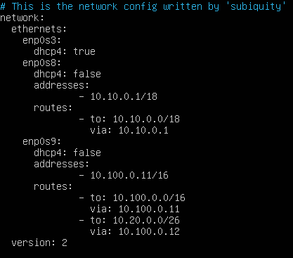

- Перезапускаем сервис сети на каждой машине командой `sudo netplan apply`. Командой ip -4 a проверяем, что адрес машины задан верно:

- ws11
  
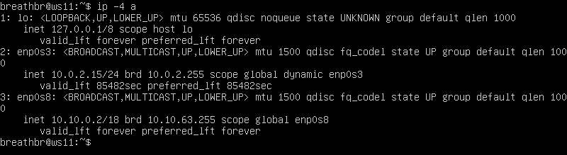

- ws21

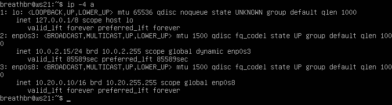

- ws22

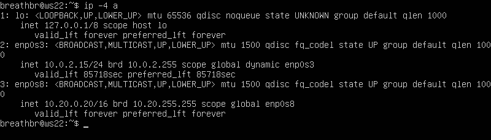

- r1

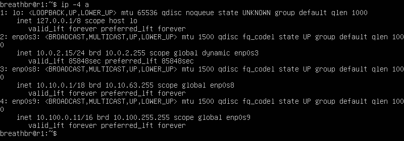

- r2

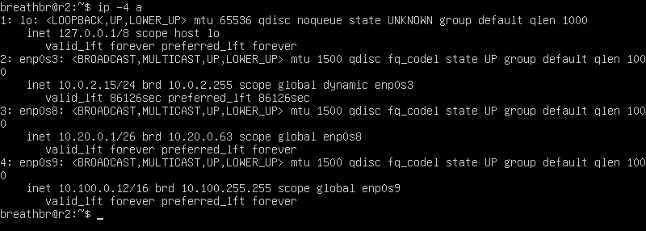

- Пингуем ws22 с ws21

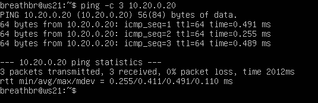

- Пингуем r1 с ws11

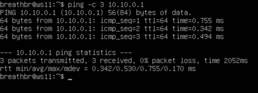

### 5.2. Включение переадресации IP-адресов

- Для включения временной переадресации IP выполняем команду на роутерах: `sudo sysctl -w net.ipv4.ip_forward=1`
  
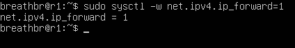

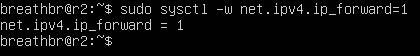

- Для включения IP-переадресации на постоянной основе добавляем в файл /etc/sysctl.conf следующую строку: `net.ipv4.ip_forward = 1`

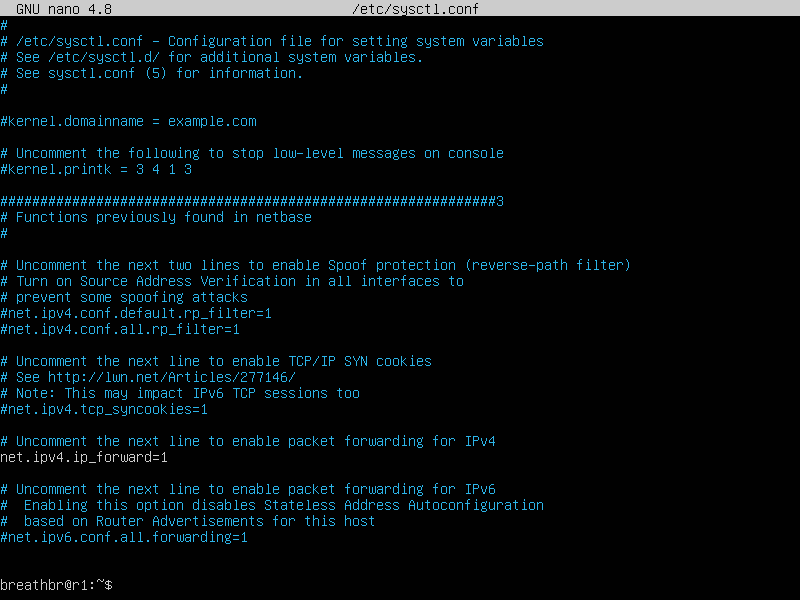

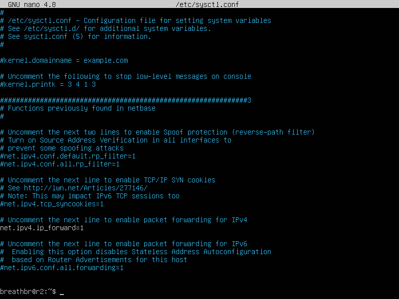

- Перезагружаем и выполняем команду `sysctl net.ipv4.ip_forward` для проверки:  

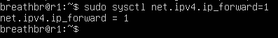
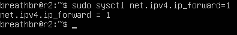

- Параметр ядра net.ipv4.ip_forward равен 1. Это означает, что переадресация включена.

### 5.3. Установка маршрута по-умолчанию

- Добавляем маршрут по-умолчанию в файле конфигураций sudo vim etc/netplan/00-installer-config.yaml.

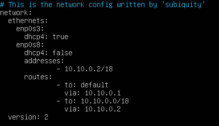
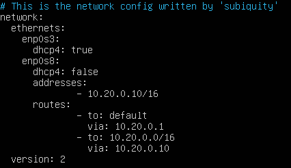
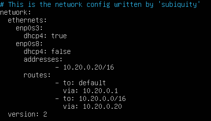

- Вызываем ip r и показать, что добавился маршрут в таблицу маршрутизации

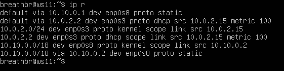

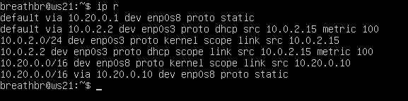

- Пингуем с ws11 роутер r2. Показываем на r2, что пинг доходит с помощью команды `tcpdump -tn -i enp0s8`

### 5.4. Добавление статических маршрутов

- Добавляем в роутеры r1 и r2 статические маршруты в файле конфигураций:

- Вызываем `ip r` чтобы показать таблицы с маршрутами на обоих роутерах:

- Запускаем команды на ws11: `ip r list 10.10.0.0/[маска сети]` и `ip r list 0.0.0.0/0`

- IP-адрес 0.0.0.0 означает «эта сеть», но для использования в традиционном смысле этот адрес непригоден. Это похоже на ссылку: «Вставьте сюда адрес», или, в зависимости от контекста, «без конкретного адреса назначения». Он действует как резервный, пока не будет назначен действительный маршрутизируемый IP-адрес. Вариант использования IP-адреса 0.0.0.0 в качестве статического маршрута по умолчанию означает, что в таблице маршрутизации не указан конкретный адрес в качестве следующего перехода на пути пакета к его конечному получателю. Когда маршрут по умолчанию используется с маской подсети 0.0.0.0, он соответствует любому адресу.

### 5.5. Построение списка маршрутизаторов

- Запускаем на r1 команду дампа: `tcpdump -tnv -i enp0s8`

- При помощи утилиты traceroute строим список маршрутизаторов на пути от ws11 до ws21:

- Команда traceroute linux использует UDP пакеты. Она отправляет пакет с TTL=1 и смотрит адрес ответившего узла, дальше TTL=2, TTL=3 и так пока не достигнет цели. Каждый раз отправляется по три пакета и для каждого из них измеряется время прохождения. Когда утилита traceroute получает сообщение от целевого узла о том, что порт недоступен трассировка считается завершенной.

### 5.6. Использование протокола ICMP при маршрутизации

- Запускаем на r1 перехват сетевого трафика, проходящего через eth0 с помощью команды: `tcpdump -n -i enp0s8 icmp`

- Пингуем с ws11 несуществующий IP с помощью команды: `ping -c 1 10.30.0.111`

## <a id="title6" style="color: white;">Part 6. Динамическая настройка IP с помощью DHCP</a>

### 6.1 Перезагрузить службу DHCP командой systemctl restart isc-dhcp-server. Машину ws21 перезагрузить при помощи reboot и через ip a показать, что она получила адрес. Также пропинговать ws22 с ws21.

- Для r2 настраиваем в файле /etc/dhcp/dhcpd.conf конфигурацию службы DHCP: указываем адрес маршрутизатора по-умолчанию, DNS-сервер и адрес внутренней сети:

- в файле /etc/resolv.conf прописать nameserver 8.8.8.8

- Перезагружаем службу DHCP командой `systemctl restart isc-dhcp-server`

- Через ip a показываем, что ws21 получила адрес:

- Пингуем ws22 с ws21:

### 6.2 Указать MAC адрес у ws11, для этого в etc/netplan/00-installer-config.yaml надо добавить строки: macaddress: 10:10:10:10:10:BA, dhcp4: true

- Указать MAC адрес у ws11, для этого в etc/netplan/00-installer-config.yaml надо добавить строки: `macaddress: 10:10:10:10:10:BA`, `dhcp4: true`

### 6.3 Для r1 настроить аналогично r2, но сделать выдачу адресов с жесткой привязкой к MAC-адресу (ws11). Провести аналогичные тесты

- Для r1 настраиваем в файле /etc/dhcp/dhcpd.conf конфигурацию службы DHCP: указываем адрес маршрутизатора по-умолчанию, DNS-сервер и адрес внутренней сети:

- в файле /etc/resolv.conf прописать nameserver 8.8.8.8.

- Перезагружаем службу DHCP командой `systemctl restart isc-dhcp-server`

- Через ip a показываем, что ws11 получила адрес:

- Пингуем ws22 с ws11:

### 6.4 Запросить с ws21 обновление ip адреса

- Через ip a показываем текущий адрес ws21:

- Принудительного освобождаем IP-адрес DHCP-клиента с помощью команды  `sudo dhclient -r`
Получаем новый IP-адрес с помощью DHCP с помощью команды `sudo dhclient`

- Через ip a показываем что адрес ws21 сменился:

- Опции DHCP сервера, которыми мы пользовались в данном пункте: 1) Настройка конфигурации службы DHCP (адрес маршрутизатора по-умолчанию, DNS-сервер, адрес внутренней сети, привязка к MAC-адресу) 2) Клиент протокола динамической конфигурации хоста (команда dhclient) для обновления или освобождения IP-адреса

## <a id="title7" style="color: white;">Part 7. NAT</a>

- Устанавливаем сервер Apache2 командой `sudo apt install apache2` на w22 и r1. В файле /etc/apache2/ports.conf на ws22 и r1 изменяем строку Listen 80 на Listen 0.0.0.0:80

- Запускаем веб-сервер Apache командой `service apache2 start` на ws22 и r1

- Создаем на r2 файл /etc/firewall.sh, имитирующий фаерволл. Добавляем в фаервол следующие правила:
  
      iptables -F
      iptables -F -t nat
      iptables --policy FORWARD DROP

- Запускаем файл командами `sudo chmod +x /etc/firewall.sh` и `sudo bash /etc/firewall.sh`

- Проверяем соединение между ws22 и r1 командой ping, ws22 не должна "пинговаться" с r1

- Добавляем в фаервол следующие правила:
  
      iptables -A FORWARD -p icmp -j ACCEPT

- Запускаем файл командами `sudo chmod +x /etc/firewall.sh` и `sudo bash /etc/firewall.sh`

- Проверяем соединение между ws22 и r1 командой ping, ws22 должна "пинговаться" с r1

- Добавляем в фаервол следующие правила:

- Отключаем сетевой интерфейс NAT. Запускаем файл командами 
  
      sudo chmod +x /etc/firewall.sh 
      sudo bash /etc/firewall.sh

- Проверить соединение по TCP для SNAT, для этого с ws22 подключаемся к серверу Apache на r1 командой: telnet 10.10.0.1 80

  
- Проверяем соединение по TCP для DNAT, для этого с r1 подключаемся к серверу Apache на ws22 командой telnet 10.20.0.20 80

## <a id="title8" style="color: white;">Part 8. Дополнительно. Знакомство с SSH Tunnels</a>

- Запускаем на r2 фаервол с правилами из Части 7:

- Запускаем файл командами `sudo chmod +x /etc/firewall.sh` и `sudo bash /etc/firewall.sh`
- Запускаем веб-сервер Apache на ws22 только на localhost (то есть в файле /etc/apache2/ports.conf меняем строку Listen 80 на Listen localhost:80

- Воспользуемся Local TCP forwarding с ws21 до ws22, чтобы получить доступ к веб-серверу на ws22 с ws21

- Воспользуемся Remote TCP forwarding c ws11 до ws22, чтобы получить доступ к веб-серверу на ws22 с ws11

- Проверим соединение по TCP для SNAT: для этого с ws22 подключимся к серверу Apache на r1 командой:

- Проверим соединение по TCP для DNAT: для этого с r1 подключимся к серверу Apache на ws22 командой telnet

